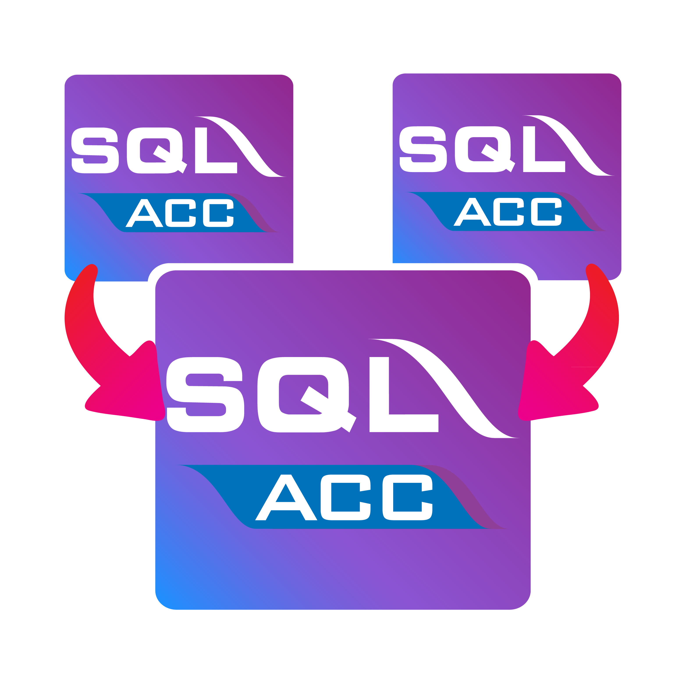

# SQL Account Consolidation Sync Tool

<p align="center">
  
</p>

A desktop tool that extracts AR (Accounts Receivable) transactions from multiple source SQL Account databases and consolidates them into a single database for unified Statement of Account grouped by Company Category reporting.

Built for Windows with SQL Account SDK (COM). The UI is web-based (NiceGUI) and opens automatically in the user's default browser at a local port.

## Quick Start

**Prerequisites:** Windows 10+, Python 3.11+, Firebird 3.0+, SQL Account 5.2025.1045.882+

```bash
pip install -r requirements.txt
python main.py
```

Or run the compiled version: `C:\eStream\Utilities\SQLAccConsolSync\SQLAccConsolSync.exe`

## Documentation

- **[User Guide](docs/user-guide.md)** — Full setup and usage instructions
- **[Changelog](CHANGELOG.md)** — Version history

## What It Does

- Syncs AR documents (IV, DN, CN, CT, PM, CF) from ~25 source databases into one consolidation database
- Auto-creates currencies, GL accounts, and payment methods
- Multi-currency support with ISO code standardization
- Skip existing (incremental) or Purge & Re-sync modes
- SST/GST tax code validation
- Opening balance support

## Architecture

**Dual data access:** reads via Firebird (`fdb` driver) for speed, writes via SQL Account SDK (COM) for business logic validation.

```
Source DBs (Firebird) → source_reader.py → transformer.py → consol_writer.py → Consolidation DB
```

## Build & Distribution

Compile the app into a standalone `.exe` and package it as a Windows installer. The output is a single `Setup_SQLAccConsolSync.exe` that users download, run, and install — **no Python needed** on the target PC.

### Build Tools

| Tool | Version | Purpose |
|---|---|---|
| Python | 3.11+ (3.14+ used for releases) | Runtime (bundled into .exe) |
| PyInstaller | 6.19+ | Compiles Python → standalone .exe |
| Inno Setup | 6.7+ | Creates Windows installer (setup wizard) |
| Pillow | 12.1+ | PNG → ICO icon conversion (one-time) |

### Step 1: Install Build Tools

```bash
pip install pyinstaller pillow
```

Download and install [Inno Setup 6](https://jrsoftware.org/isdl.php) (free, ~4 MB).

### Step 2: Convert Icon (one-time only)

Skip this if `icon.ico` already exists in the project root.

```bash
python -c "from PIL import Image; img = Image.open('icon.png'); img.save('icon.ico', format='ICO', sizes=[(16,16),(24,24),(32,32),(48,48),(64,64),(128,128),(256,256)])"
```

### Step 3: Compile .exe with PyInstaller

Always build from the existing spec file. **Do not regenerate it** with `pyinstaller main.py` — the regenerated spec will be missing critical NiceGUI handling and produce a silently-crashing exe.

```bash
# Clean rebuild (recommended — old build artifacts can mask new bundling errors)
rm -rf dist build
pyinstaller SQLAccConsolSync.spec --clean --noconfirm
```

> **Why the spec file is special — three non-obvious PyInstaller gotchas baked in:**
>
> 1. **`collect_all('nicegui')`** at the top of the spec bundles ~780 NiceGUI static files (Quasar, Vue, Tailwind, fonts) and dynamically-imported deps (uvicorn, fastapi, websockets, watchfiles, starlette). PyInstaller's static analyzer can't see these. Without `collect_all`, the bundle compiles fine but **silently crashes the moment NiceGUI tries to serve a page** because the static files are missing.
> 2. **`hiddenimports=[..., 'fdb', 'win32com', 'win32com.client', 'pythoncom']`** — these are imported lazily and would otherwise be missed.
> 3. **NiceGUI auto-index mode is incompatible with PyInstaller** — see [main.py](main.py) and [nicegui_app.py](nicegui_app.py). The `create_app()` function uses `@ui.page('/')` instead of auto-index because auto-index calls `runpy.run_path(sys.argv[0])` to re-execute the script per request, which fails with `SyntaxError: source code string cannot contain null bytes` when `sys.argv[0]` is a frozen `.exe` binary.
> 4. **`sys.stdout`/`sys.stderr` shim in `main.py`** — `--windowed` builds have `sys.stdout = None`, but uvicorn calls `sys.stdout.isatty()` during logging setup. The shim at the top of [main.py](main.py) substitutes `io.StringIO()` for any `None` stream **before** any uvicorn-pulling import. Without it, the app fails with `AttributeError: 'NoneType' object has no attribute 'isatty'` and never reaches `ui.run()`.

Output in `dist/SQLAccConsolSync/` (~250 MB unpacked, dominated by Python runtime + NiceGUI):

```
dist/SQLAccConsolSync/
├── SQLAccConsolSync.exe        ← Main executable
├── _internal/                  ← Python runtime & dependencies
│   ├── icon.ico
│   ├── icon.png
│   ├── CHANGELOG.md
│   ├── assets/
│   │   └── 1. Cust Statement 12 Mths 1 - Group.fr3
│   ├── nicegui/                ← ~780 NiceGUI static files (~69 MB)
│   ├── fdb/, win32/, ...       ← third-party deps
│   └── base_library.zip        ← Python stdlib
├── config.json                 ← Created at runtime (next to .exe)
├── logs/                       ← Created at runtime
└── startup_error.log           ← Created only on startup crash (see Troubleshooting)
```

### Step 3a: Smoke-test the bundle before building the installer

A 60-second installer rebuild is wasted if the bundle is broken. PyInstaller `--windowed` builds **silently** crash on startup errors — there's no console, no popup, just a process that exits. Always verify the bundle works **before** packaging it:

```bash
# Terminal 1 — launch the bundled exe
cd dist/SQLAccConsolSync
./SQLAccConsolSync.exe
```

Wait 5–8 seconds for NiceGUI to start, then in another terminal:

```bash
# Terminal 2 — confirm the page actually serves (the part that crashed before)
curl -s -o /dev/null -w "HTTP %{http_code}\n" http://localhost:8080/
# Expected: HTTP 200
```

**Verdict checklist:**
- ✓ `tasklist | grep SQLAccConsolSync.exe` shows the process
- ✓ `curl` returns `HTTP 200` (or whatever port NiceGUI picked — see terminal 1 banner)
- ✓ `dist/SQLAccConsolSync/startup_error.log` does **not** exist
- ✓ Hitting the URL in a browser shows the actual UI

If any check fails, **read `startup_error.log` first** — it will contain the full traceback. Don't rebuild blindly.

### Step 4: Build Installer with Inno Setup

```bash
"C:\Program Files (x86)\Inno Setup 6\ISCC.exe" installer.iss
```

Output: `installer_output/Setup_SQLAccConsolSync.exe` (~42 MB single file — Python 3.14 runtime + NiceGUI is heavier than the old CustomTkinter bundle).

### Step 5: Distribute

Share `Setup_SQLAccConsolSync.exe` with users. They run it and get:

1. Setup wizard → Next → Next → Finish
2. Installs to `C:\eStream\Utilities\SQLAccConsolSync\`
3. Desktop shortcut with app icon
4. Start Menu entry
5. Proper uninstall via "Add/Remove Programs"

### Target PC Requirements

- Windows 10+ (64-bit)
- SQL Account 5.2025.1045.882+ (with SDK COM registered)
- Firebird Server 3.0+
- **No Python needed** — bundled in the `.exe`

### Troubleshooting: app installed but won't launch

PyInstaller `--windowed` builds suppress all console output and crash silently if anything goes wrong on startup. To diagnose, check this file on the user's PC:

```
C:\eStream\Utilities\SQLAccConsolSync\startup_error.log
```

If the file exists, it contains the full Python traceback from the failed launch (written by `_write_startup_error()` in [main.py](main.py)). Common causes and fixes:

| Traceback signature | Cause | Fix |
|---|---|---|
| `SyntaxError: source code string cannot contain null bytes` in `runpy.run_path` | NiceGUI auto-index mode used instead of `@ui.page('/')` | Verify [nicegui_app.py](nicegui_app.py) wraps UI build in `@ui.page('/')` decorator |
| `AttributeError: 'NoneType' object has no attribute 'isatty'` in `uvicorn/logging.py` | `sys.stdout`/`sys.stderr` are `None` in windowed mode and the shim was removed | Verify [main.py](main.py) has the `io.StringIO()` shim **at the very top, before any other import** |
| `ModuleNotFoundError: No module named 'nicegui.xyz'` or 404 errors serving NiceGUI assets | NiceGUI's static files / hidden imports not bundled | Verify [SQLAccConsolSync.spec](SQLAccConsolSync.spec) uses `collect_all('nicegui')` |
| `ModuleNotFoundError: No module named 'fdb'` (or `win32com`, `pythoncom`) | Lazy-loaded module not in `hiddenimports` | Add to the `hiddenimports` list in the spec |
| (file does not exist at all) | App crashed before reaching the error handler — extremely early failure | Run the bundled exe from `cmd.exe` (not Explorer) and watch for any output; check Windows Event Viewer → Application logs |

Always rebuild and **smoke-test (Step 3a)** before sending a new installer to a user. Don't ship a build you haven't `curl`-tested.